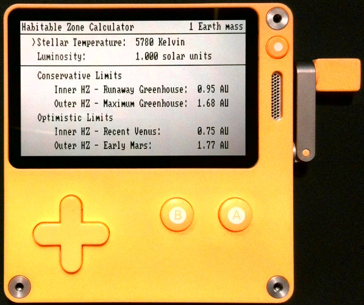

# Habitable Zone Calculator for Playdate
This is a [Playdate](https://play.date/) application that calculates the inner and outer boundaries of the liquid water habitable zone (HZ) for planetary systems.

The liquid water habitable zone (sometimes called the "Goldilocks Zone") is the region around a star where an Earth-like planet could sustain liquid water on its surface. The inner edge of the HZ is the orbital distance where an Earth-like planet would enter a runaway greenhouse and be too warm to sustain a liquid water ocean. The outer edge of the HZ is the orbital distance where a planet is too hot to sustain liquid water (because it enters a runaway greenhouse state). The inner edge of the HZ is th orbital distance where a planet is too cold to sustain liquid water (because it reaches the maximum greenhouse effect where no additional amount of carbon dioxide can keep the planet warm). These limits are based on the exoplanet climate model simulations performed by Kopparapu et al. ([2013](http://doi.org/10.1088/0004-637X/765/2/131), [2014](http://doi.org/10.1088/2041-8205/787/2/L29)). 

## What is Playdate?
[Playdate](https://play.date/) is a handheld video game system developed by [Panic](https://panic.com/). The console features a non-reflective black and white display, a directional pad, A and B buttons, and a foldable crank. The Playdate SDK is open source, allowing anyone to develop their own games and applications!

If you do not own a Playdate, then you can download the [Playdate simulator](https://playdate-wiki.com/wiki/Playdate_Simulator) as part of the SDK, which will allow you to run any Playdate software on your Windows, Mac, or Linux machine.

## How do I install this?

You can download the ZIP file of the latest [HZ Calculator release](https://github.com/haqqmisra/HabZonePlaydate/releases) and [sideload](https://help.play.date/games/sideloading/) it on to your Playdate. If you are using the Playdate simulator, then you can download the latest release and open it in the simulator.

## Using the HZ Calculator on Playdate

The HZ is calculated as a function of the stellar effective temperature and stellar luminosity. Use the UP and DOWN arrows to toggle between stellar temperature and luminosity, and use the LEFT and RIGHT arrows to increase or decrease the values. You can also use the CRANK to increase or decrease these values. The HZ boundaries will automatically update as you adjust these values. The HZ boundaries include the "conservative" limits based on the runaway and maximum greenhouse values as well as the "optimistic" limits based on empirical evidence of the duration that water lasted on Venus and Mars.

Press the B button to reset the configuration to the default values for Earth orbiting the Sun.

Press the MENU button to access additional options. You can choose between 10 different preset configurations for various stars that host exoplanets. You can also choose to change the planetary mass between Earth, a super-Earth (5 Earth masses), and a sub-Earth (0.1 Earth masses).

## References and Credits

Kopparapu, R. K., Ramirez, R., Kasting, J. F., Eymet, V., Robinson, T. D., Mahadevan, S., Terrien, R. C., Domagal-Goldman, S., Meadows, V., & Deshpande, R. (2013). [Habitable zones around main-sequence stars: new estimates](https://doi.org/10.1088/0004-637X/765/2/131). _The Astrophysical Journal_, 765(2), 131.

Kopparapu, R. K., Ramirez, R. M., SchottelKotte, J., Kasting, J. F., Domagal-Goldman, S., & Eymet, V. (2014). [Habitable zones around main-sequence stars: dependence on planetary mass](https://doi.org/10.1088/2041-8205/787/2/L29). _The Astrophysical Journal Letters_, 787(2), L29.

This implementation of the Habitable Zone calculator is based on the [Python code developed by Eelt](https://github.com/Eelt/HabitableZoneCalculator.git).

This application uses the [IBM DOS Playdate Font Pack developed by notpeter](https://notpeter.itch.io/playdate-dos-fonts).
